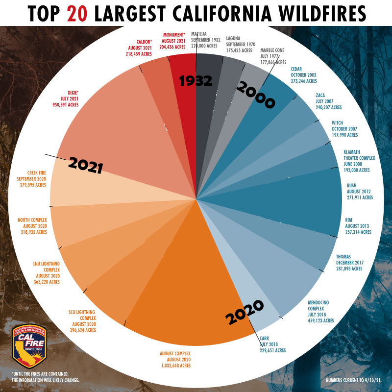

https://eagereyes.org/blog/2021/can-a-timeline-pie-chart-work

The idea of using a pie chart as a timeline seems counterintuitive, largely due to the use of the word "line," which is absent here. This chart, illustrating the acres burned in the 20 largest California wildfires, isn't aimed at showing us a sequence of events. Instead, it highlights that, by far, the most destructive wildfires have occurred since 2000.

We are examining two dimensions: time and fire size. However, the fires are not categorized by their severity. The article includes a bar graph that does this, but the chronologial grouping is lost. Placing emphasis on the fires' sizes serves only to show the viewer how devastating these fires can be. This is important, but it misses the point.

At first, I found this chart hard to read because it's called a "timeline" but doesn’t have a line. Putting the 2021 fires next to the pre-2000 ones without a clear break almost implies a temporal loop back to the 20th century after the 2021 wildfires. Starting from 0 degrees, or "north," there is continuity between the colored sections until "north" is reached again. It feels inconsistent.

In defense of the pie chart, the graphic itself does not claim to be a "timeline." I think my confusion comes more from the way the article talks about it, not from the chart maker. If I had to name this pie chart, I'd call it a clock and use years for the clock's numbers. This analogy might better illustrate how the years, especially since 2000, are disproportionately represented.

After trying it, I don't think this did aything to help. I'm not sure how to improve upon this visualization.