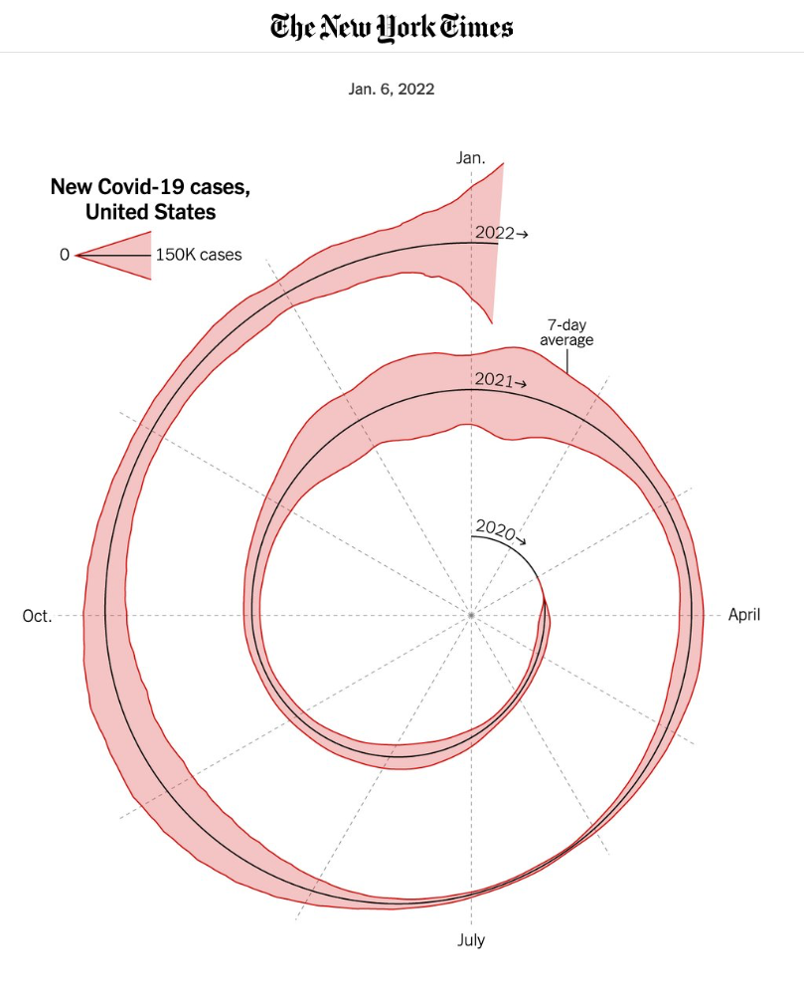

Nick Whalen

This New York Times' sprial graph of Covid-19 Cases in 2022 caught my eye this week. I found it on Eager Eyes' blog. They posted it critiquing how the spiral was off-center when compared to a Archimdean spiral, but liked the choice to use on overall, despite the initial negative reaction from others in the data visualization community. This visualization stuck out me because of it's scale. It is very hard for me to even get a rough idea of the estimation of COVID cases at any given point. The spiral orientation makes it hard for me to compare any given point to a previous point on the visualization. If I were to visualize this, I probably would have stuck with something more basic, like a simple line chart. I think NYT's intention was not to show exact numbers, but instead give a rough idea of the change in number of cases from 2020-2022, but I think this way of showing it takes a lot more effort to understand than it should. All that I really took away from seeing this visualization upon first look was that the number of cases changed as time went on, which is not a super meaningful conclusion, in my opinion. That being said, I did enjoy the unique visual style, and I was able to understand what it was trying to communicate, just not in the most effective way they could have done. 