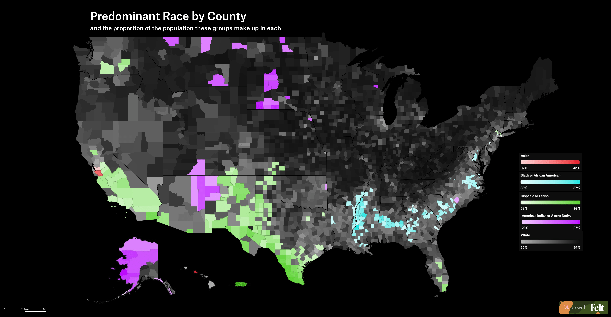

The visualization that got my attention this week was a map of the entire US that shows the predominant race of every county in every state, and gives the percentage that race makes up of the county's population. It achieves this by using different colors for each race, and the percentage they make up of the county's population scales with the luminance of the color. This visualization is very effective, as it uses colors that greatly contrast each other, and I can quickly identify the predominant race of any given county, or area of the United States. The author chose to use the color black, for people that identify as white, and counties on the visualization are made up of predominantly white people, although to varying degrees of proportionality. Some things that surprised me from this visualization was how the population seems to be most diverse on the east and west coasts (usually predominantly white, but with very little luminescence, indicating a low total proportionality), and the midwestern united states appeared to be the opposite. 